# Gmail Android App Documentation

## Table of Contents
- [Overview](#overview)
- [User Activities](#user-activities)

---

## Overview
This is an **Android application** for a Gmail-like system that integrates with a **Node.js + MongoDB backend**, and a C++ blacklist server via TCP.

Users can:
- Register and log in
- View their inbox and sent mail
- Compose new emails or save drafts
- Search, label, star, delete, or mark emails as spam
- Manage custom and built-in labels

---

## User Activities

### 1. Login Activity
- Allows users to log in using a **username and password**.
- Link to register is available at the bottom.

  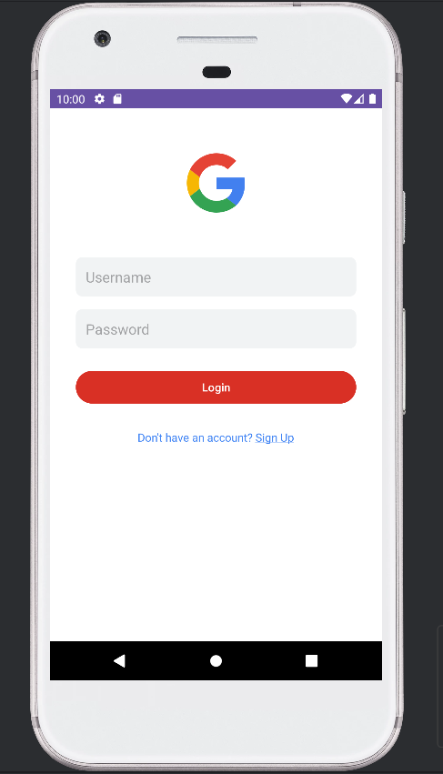

---

### 2. Register Activity
- Allows new users to create an account with:
  - Username
  - Full name
  - Password & confirm password
  - Profile picture (optional)

  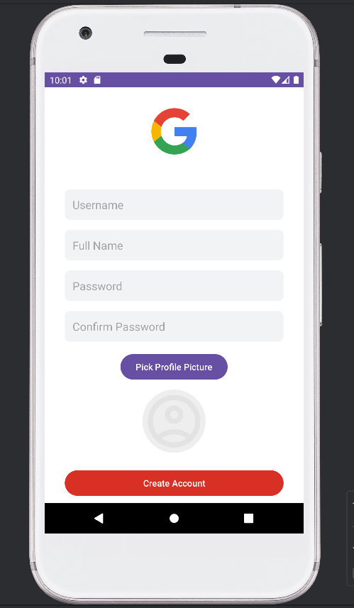

- Profile picture is selected from local storage:

  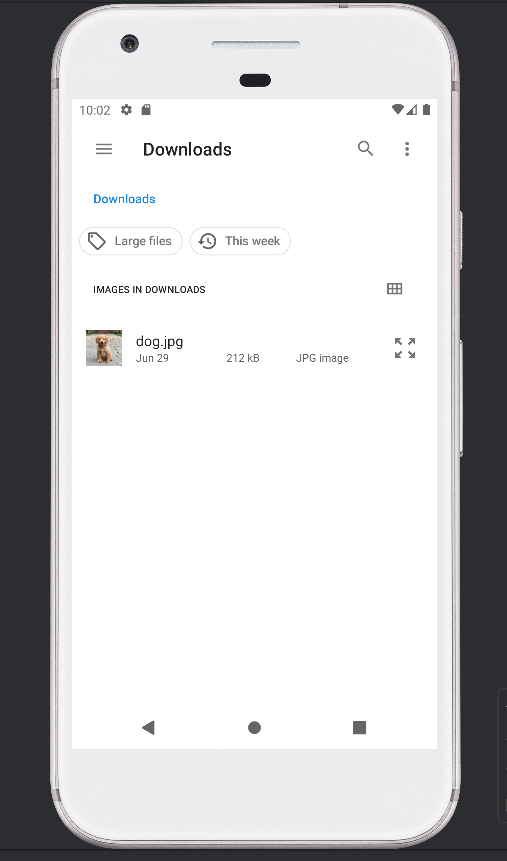

---

### 3. Inbox Activity
- Shows list of received mails.
- Each mail can be opened, deleted, or starred.

  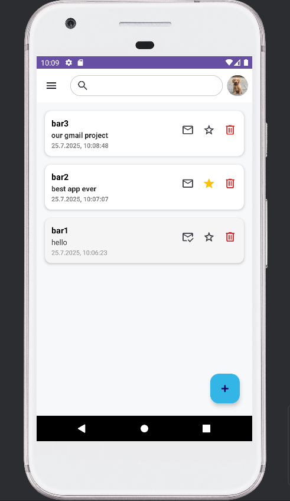

---

### 4. Compose Mail
- Users can write a new mail, send it, or save it as a draft.

  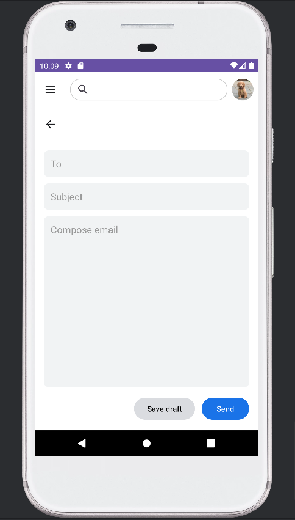

---

### 5. Mail Detail View
- Opens a mail for full view.
- Allows applying/removing labels, starring, deleting, or marking as spam/unread.

  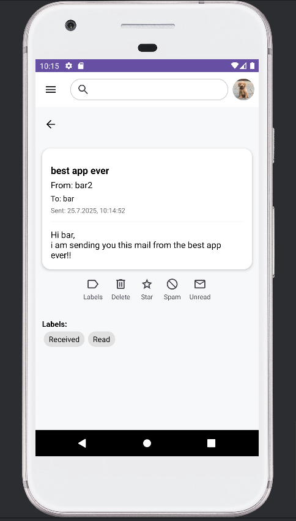

---

### 6. Edit Draft Email
- Draft mails are displayed in the inbox with a timestamp.
- When a user taps on a draft, it opens the **Compose Mail screen** with:
  - Pre-filled "To" field
  - Pre-filled "Subject" field
  - Pre-filled body (if any)
- The user can then continue editing and either **send** the mail or **save** it again.

  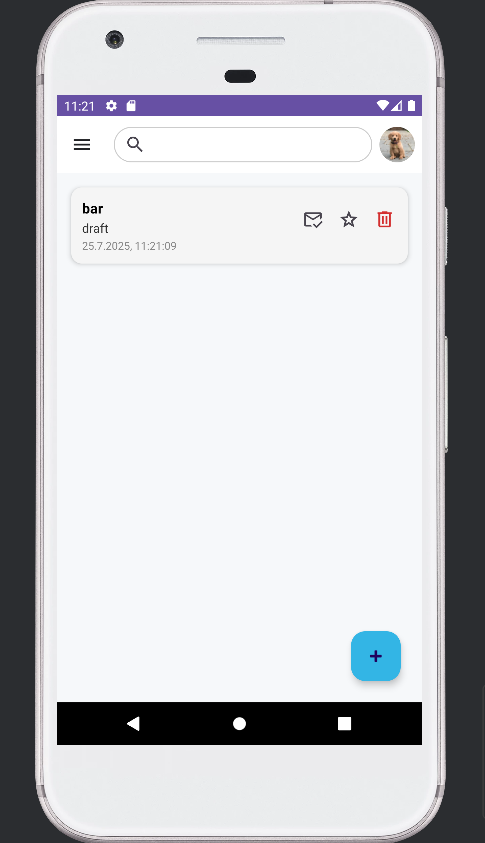

  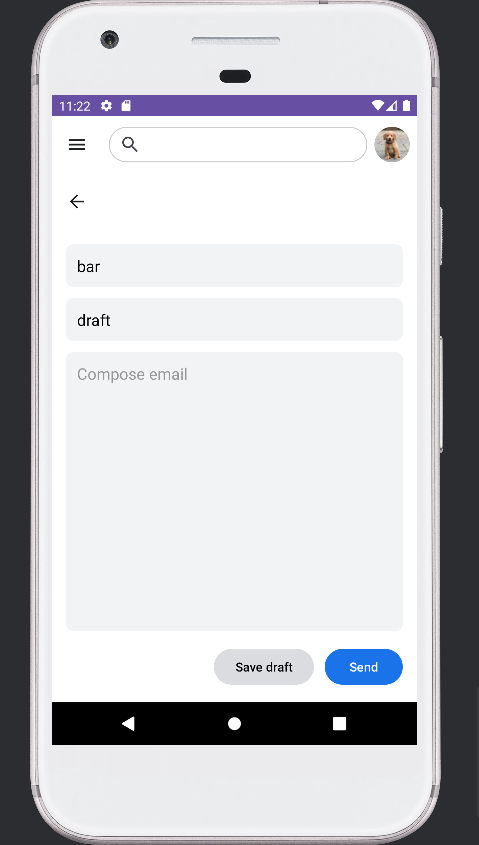

---

### 7. Label Management
- Users can add or remove custom labels from a mail.

  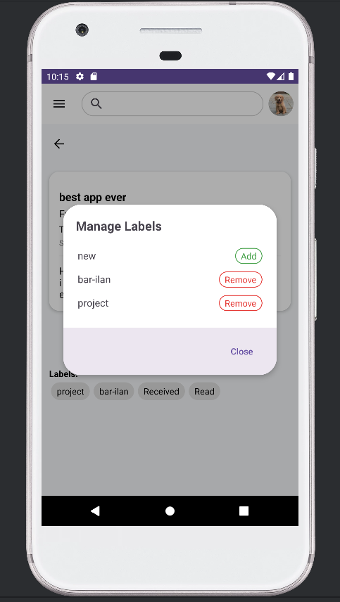

---

### 8. Navigation Drawer
- Built-in labels available:
  - Inbox
  - Sent
  - Star
  - Trash
  - Spam
  - Drafts
  - Read / Unread
- Option to add a new label

  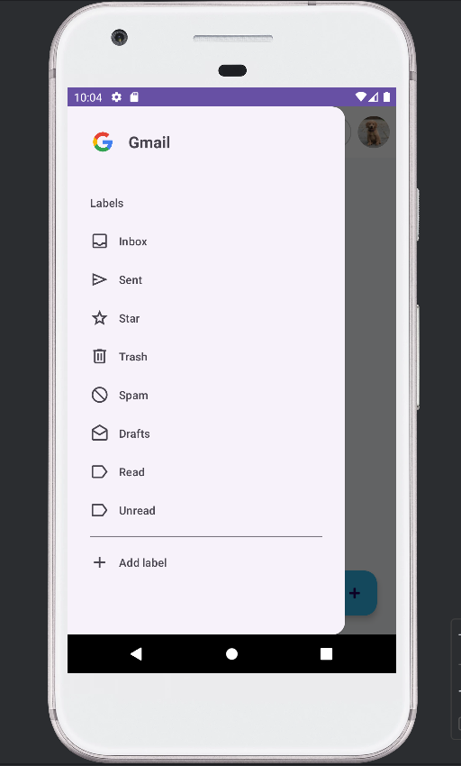

---

### 9. Add New Label
- Users can define a new label name and add it to the system.

  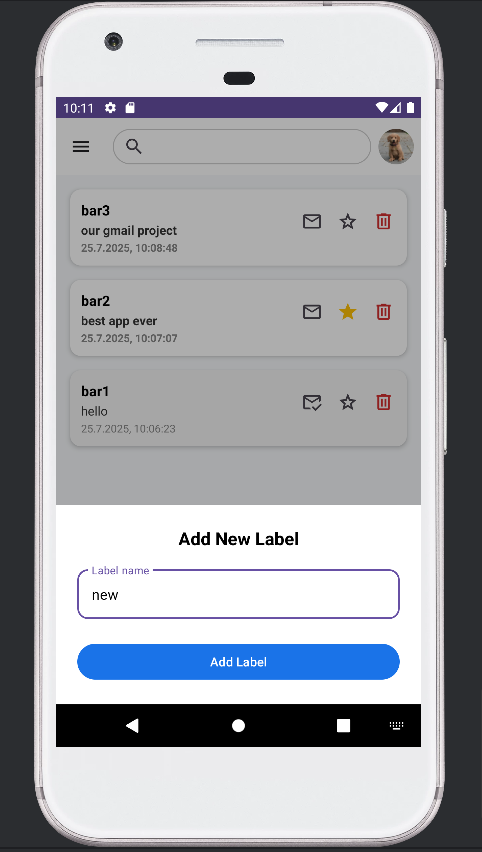

---

### 10. Search Emails
- Users can search mails by content, sender, or subject.
- Results are filtered live.

  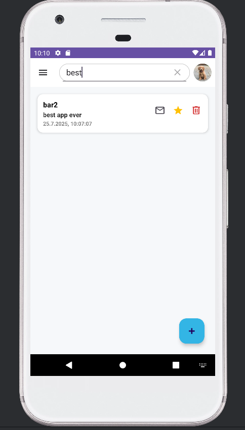

---

### 11. Profile & Logout
- Clicking the profile image opens a menu with profile details and logout option.

  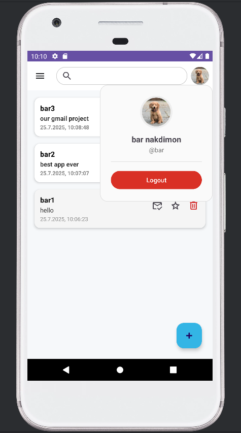

