# Gmail Web App Documentation

## Table of Contents
- [Overview](#overview)
- [User Activities](#user-activities)

---

## Overview
This is a **React-based web application** for a Gmail-like system that connects to a **Node.js + MongoDB backend**, and a C++ TCP server for blacklist URL checking.

Users can:
- Sign up and log in
- View received and sent emails
- Compose, edit, and delete emails
- Apply labels, star, delete, and mark as spam
- Manage custom labels and search mails
- Edit drafts and view mail details

---

## User Activities

### 1. Login Page

  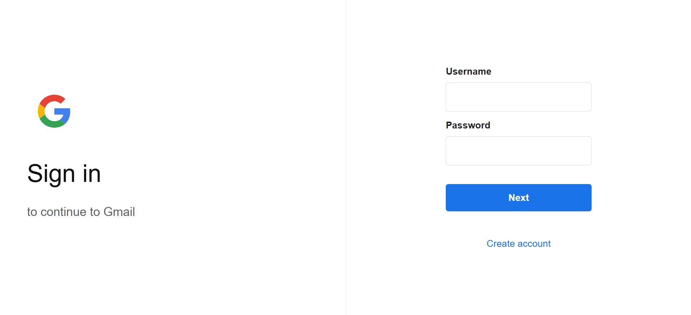

---

### 2. Register Page

  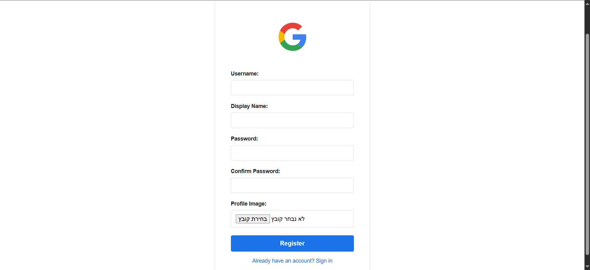

---

### 3. Inbox View

  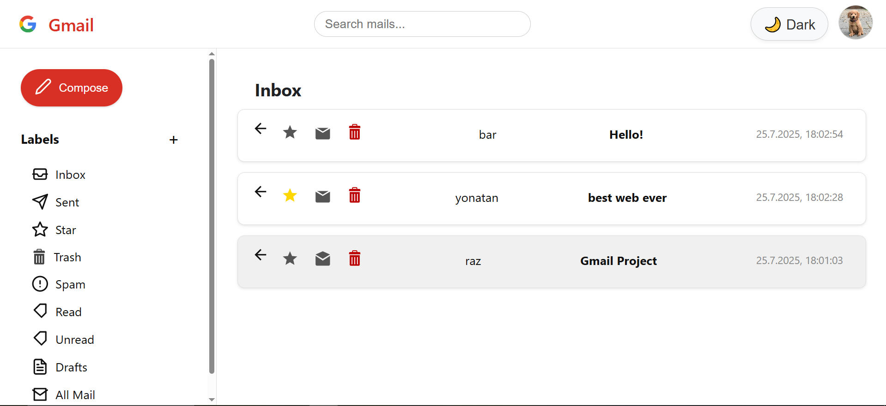

  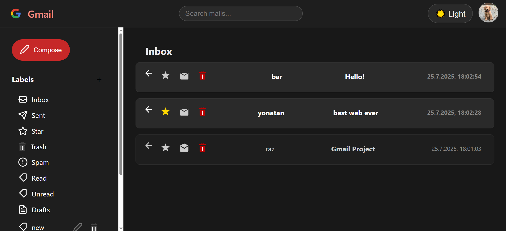

---

### 4. Mail Detail View

  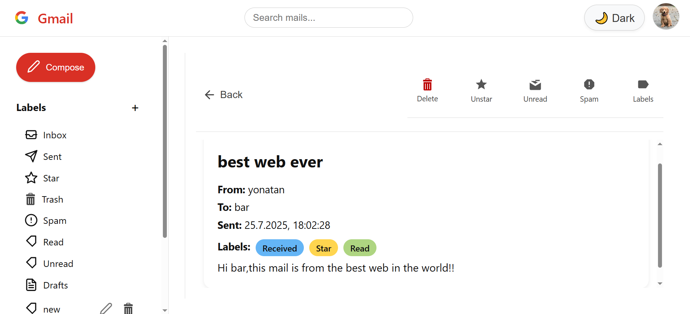

  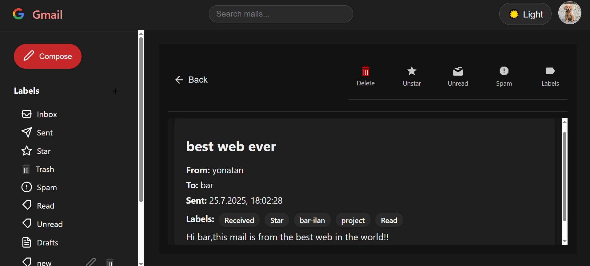

---

### 5. Compose Mail
- Users can compose a new email.
- Options include sending or saving as draft.

  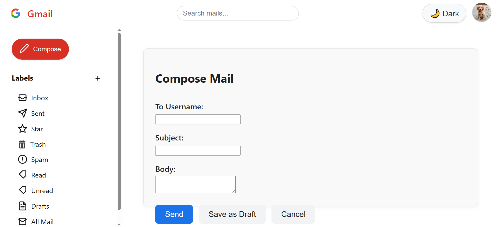

  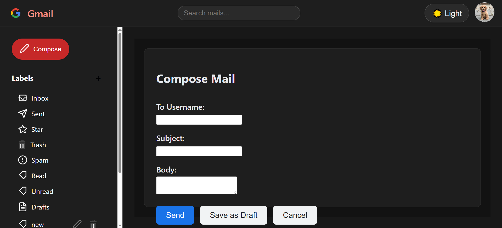

---

### 6. Edit Draft Email
- Drafts appear in the inbox when filtered by label.
- Clicking a draft opens the compose screen with pre-filled data (if any).

  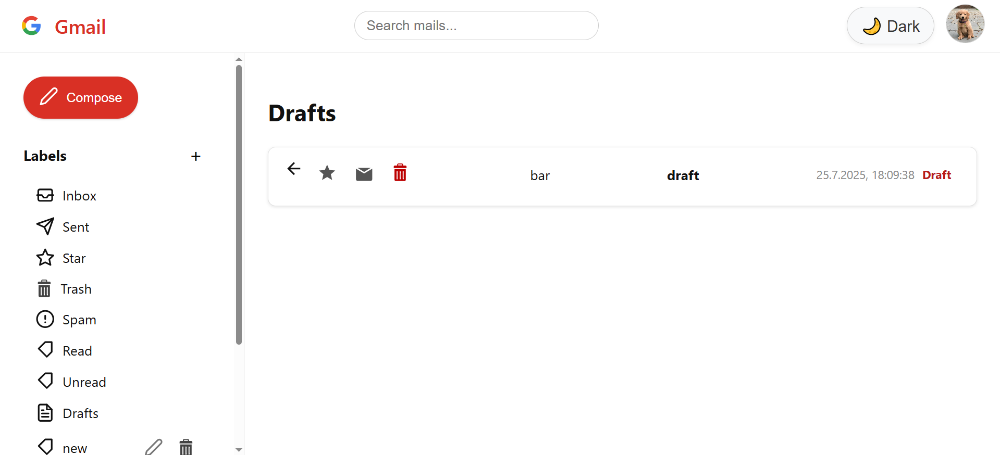

  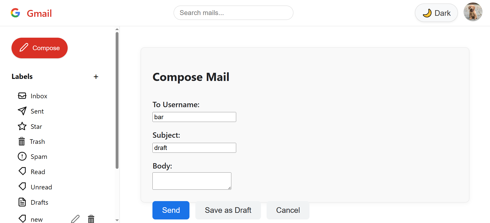

---

### 7. Label Management

  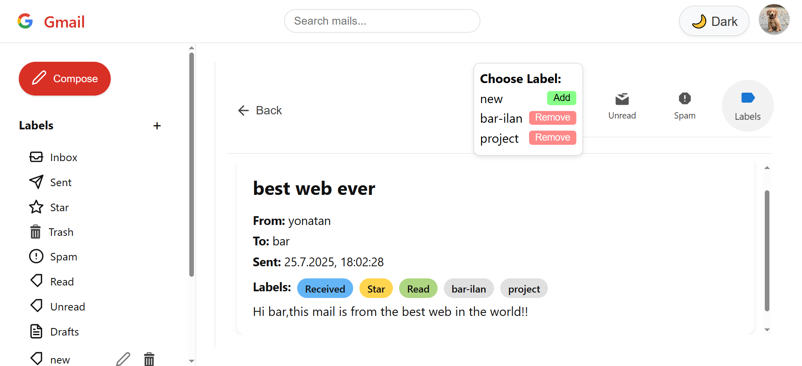

  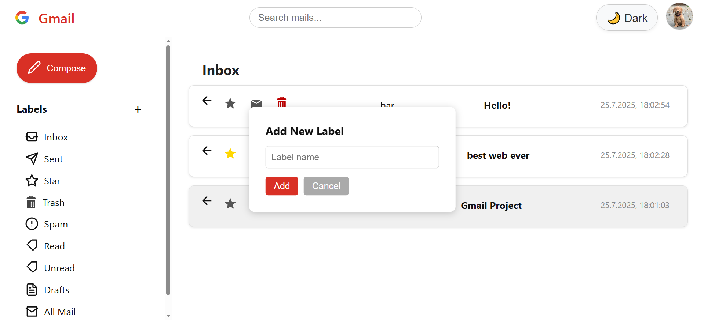

---

### 8. Search Emails

  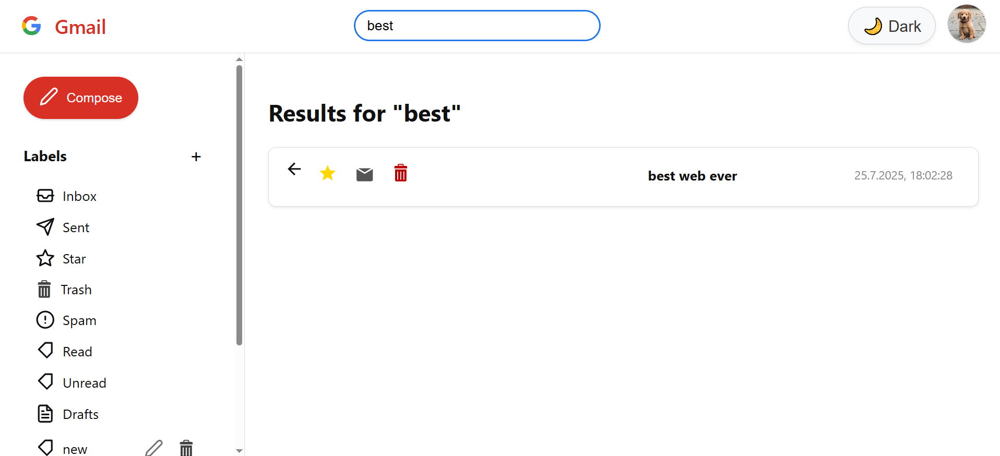

---

### 9. Profile Menu

  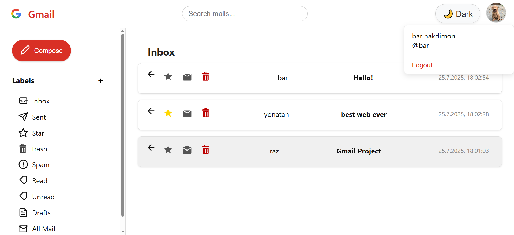

